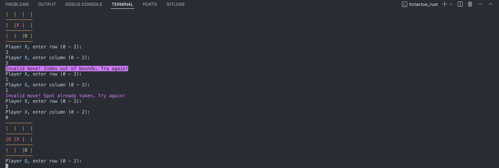

# Tic-Tac-Toe in Rust

This is a simple terminal-based Tic-Tac-Toe game implemented in Rust. The game allows two players to play against each other by taking turns to place their marks (`X` and `O`) on a 3x3 grid. The first player to align three of their marks vertically, horizontally, or diagonally wins the game.



## Features

- Two-player mode.
- Input validation (checks for valid moves and grid boundaries).
- Colored output to distinguish between players.

## Requirements

- Rust (version 1.56.0 or newer recommended)
- Cargo (Rust's package manager)

## Installation

1. Clone this repository to your local machine:
   ```bash
   git clone https://github.com/togisoft/tic-tac-toe-rust.git
   cd tic-tac-toe-rust
